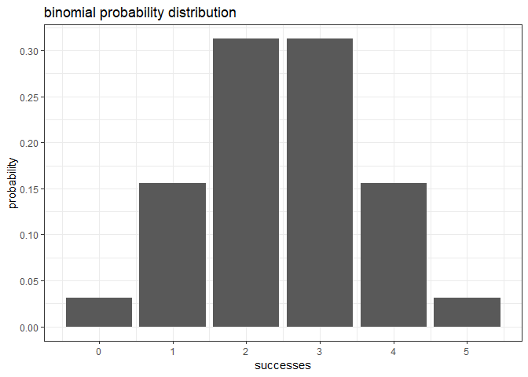
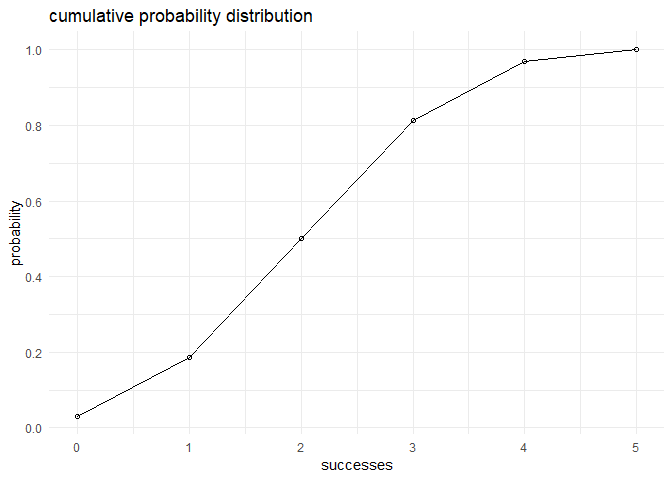

<!-- README.md is generated from README.Rmd. Please edit that file -->
Overview
--------

`"binomial"` is a minimal [R](http://www.r-project.org/) package that implements functions for calculating probabilities of a Binomial random variable, and related calculations such as the probability distribution, the expected value, variance, etc. .

-   `bin_choose`, `bin_probability` calculates the number of combinations and binomial probability given the number of trials and successes
-   `bin_distribution` and `bin_cumulative` presents non-cumulative and cumulative probability distribution of a given binomial variable.
-   `bin_variable()` creates a binomial variable, which you also contains statistical information about a binomial variable.
-   `bin_mean`, `bin_variance`, `bin_mode`, `bin_skewness` and `bin_kurtosis` computes basic statistical measures for a given binomial variable.
-   `plot()` method for a binomial distribution.
-   `summary()` method for a binomail variable.

Motivation
----------

This package has been developed to illustrate some of the concepts behind the creation of an R package.

Installation
------------

Install the development version from GitHub via the package `"devtools"`:

``` r
# development version from GitHub:
#install.packages("devtools") 
# install "binomial" (without vignettes)
devtools::install_github("BolongZh/binomial")
# install "binomial" (with vignettes)
devtools::install_github("BolongZh/binomial", build_vignettes = TRUE)
```

Usage
-----

``` r
library(binomial)
#computes the number of combinations for a given number of trials and successes
bin_choose(n = 5, k = 2)
#> [1] 10
# probability of getting 2 successes in 5 trials
# (assuming prob of success = 0.5)
bin_probability(success = 2, trials = 5, prob = 0.5)
#> [1] 0.3125
# plotting binomial probability distribution
dis1 <- bin_distribution(trials = 5, prob = 0.5)
plot(dis1)
#> Warning: Ignoring unknown parameters: binwidth, bins, pad
```



``` r
# plotting binomial cumulative distribution
dis2 <- bin_cumulative(trials = 5, prob = 0.5)
plot(dis2)
```



``` r
# obtain summary of a binomial variable
bin1 <- bin_variable(trials = 10, p = 0.3)
binsum1 <- summary(bin1)
binsum1
#> "Summary Binomial"
#> 
#> Parameters
#> - number of trials:  10 
#> - prob of success:  0.3 
#> 
#> Measures
#> - mean    :  3 
#> - variance:  2.1 
#> - mode    :  3 
#> - skewness:  0.2760262 
#> - kurtosis:  -0.1238095
# apply functions of measures to get basic statistics of a binomial object
bin_mean(10, 0.3)
#> [1] 3
bin_variance(10, 0.3)
#> [1] 2.1
bin_mode(10, 0.3)
#> [1] 3
bin_skewness(10, 0.3)
#> [1] 0.2760262
bin_kurtosis(10, 0.3)
#> [1] -0.1238095
```
